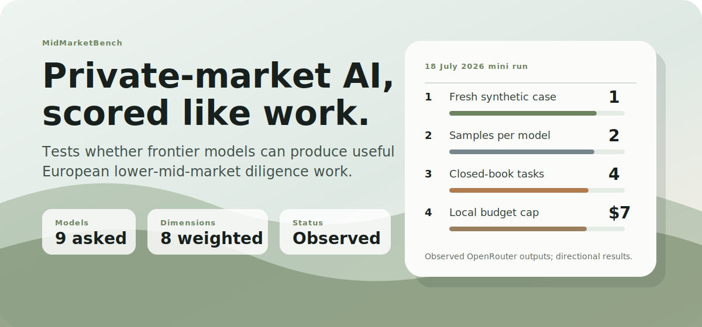
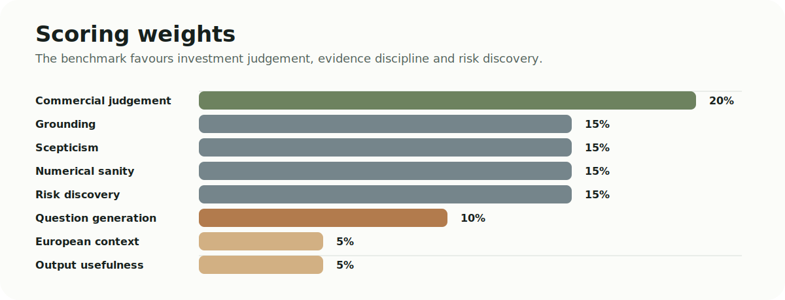
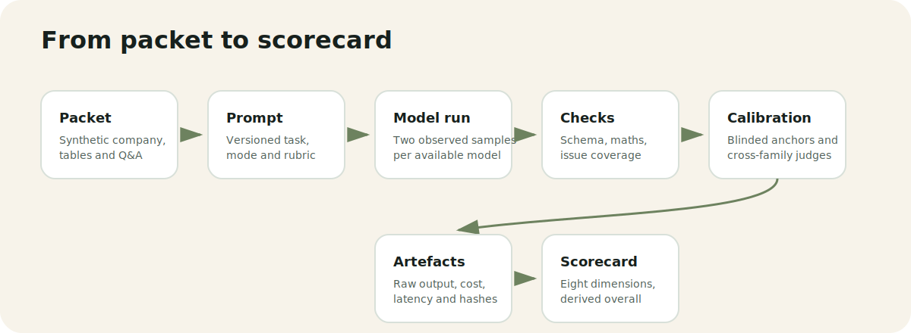

# MidMarketBench

Observed frontier-model benchmarking for European lower-mid-market investment work.

[](https://midmarketbench.vercel.app)
[](#methodology)
[](https://nextjs.org)
[](https://www.typescriptlang.org)



MidMarketBench asks a practical question: can a frontier model turn a sparse, commercially sensitive diligence packet into work an investment team can use?

The 18 July 2026 release is a real, budget-bounded mini benchmark. The company is synthetic; candidate and judge outputs, routing metadata, costs, latency and scores are observed OpenRouter runs.

| Item             | Current state                                                  |
| ---------------- | -------------------------------------------------------------- |
| Live product     | [midmarketbench.vercel.app](https://midmarketbench.vercel.app) |
| Methodology      | `v0.4-mini`                                                    |
| Run mode         | Closed-book                                                    |
| Case             | Norwyn Controls, created fresh for this run                    |
| Tasks            | Four                                                           |
| Samples          | Two per available model                                        |
| Candidate roster | Nine models requested through OpenRouter                       |
| Spend control    | USD 7 process guard plus a USD 7.50 OpenRouter key cap         |

## Result Scope

This release is directional, not universal. One company, four tasks and two samples can reveal useful workflow behaviour, but cannot establish general intelligence, reliability or value across other domains.

- Complete two-sample results are ranked.
- Models within two overall points are marked as provisional ties.
- Partial and unavailable models remain visible for provenance but are excluded from ranked positions.
- A provider or endpoint failure is not scored as model incompetence.
- Results are not investment advice.

## Observed Result

Eight models completed both samples. Claude Fable 5 was unavailable on its listed OpenRouter routes and is disclosed
without a score. Settled spend on the dedicated key was USD 5.315590.

| Rank | Model            | Overall | Two-sample range | Status          |
| ---: | ---------------- | ------: | ---------------: | --------------- |
|    1 | Kimi K3          |   96.28 |      95.64–96.91 | Provisional tie |
|    2 | Grok 4.5         |   96.27 |      95.54–96.99 | Provisional tie |
|    3 | GPT-5.6 Sol      |   95.50 |      95.11–95.89 | Provisional tie |
|    4 | Gemini 3.5 Flash |   89.07 |      86.88–91.26 | Provisional tie |
|    5 | Claude Opus 4.8  |   88.76 |      80.15–97.37 | Provisional tie |
|    6 | DeepSeek V4 Pro  |   88.63 |      87.87–89.39 | Provisional tie |
|    7 | GLM 5.2          |   88.15 |      86.62–89.68 | Provisional tie |
|    8 | Qwen3.7 Max      |   65.50 |      44.58–86.42 | Complete        |

Kimi K3 has the highest point estimate by 0.01, not a decisive lead. Under the published two-point rule, Kimi, Grok
and GPT are a provisional top group.

## Candidate Roster

The point-in-time roster was checked against the OpenRouter catalogue and endpoint API on 18 July 2026.

| Model            | OpenRouter model ID         |
| ---------------- | --------------------------- |
| Claude Fable 5   | `anthropic/claude-fable-5`  |
| GPT-5.6 Sol      | `openai/gpt-5.6-sol`        |
| Kimi K3          | `moonshotai/kimi-k3`        |
| Claude Opus 4.8  | `anthropic/claude-opus-4.8` |
| Grok 4.5         | `x-ai/grok-4.5`             |
| Gemini 3.5 Flash | `google/gemini-3.5-flash`   |
| GLM 5.2          | `z-ai/glm-5.2`              |
| Qwen3.7 Max      | `qwen/qwen3.7-max`          |
| DeepSeek V4 Pro  | `deepseek/deepseek-v4-pro`  |

Three blinded judges are configured: GPT-5.6 Terra, Claude Sonnet 5 and Gemini 3.1 Pro Preview. A judge from the same provider family as the candidate is excluded from that candidate's score.

Kimi K3 is qualified precisely: the dated result is Moonshot AI's OpenRouter route using the available INT4 endpoint and mandatory maximum reasoning. It is not presented as a full-precision or downloadable-weights result. See [`notes/model-roster.md`](notes/model-roster.md).

## Case And Tasks

Norwyn Controls is a synthetic UK, DACH and Benelux quality and maintenance workflow software company. The packet contains management claims, an ARR bridge, expansion composition, retention, revenue and margin data, EBITDA and cash adjustments, concentration, implementation performance, channel evidence, TAM construction, process constraints and an untrusted instruction embedded in source material.

Every candidate receives the same closed-book packet and four tasks:

1. Reconstruct eleven operating, retention, margin and market metrics with formulae and exact evidence IDs.
2. Return six ranked, company-specific red flags linked to management claims, evidence and diligence actions.
3. Select exactly four diligence actions within EUR 25k and eight parallel working days.
4. Write an IC decision note on whether to authorise EUR 250k of confirmatory diligence.

No web access, tools or follow-up questions are available to candidates in this release.

## Methodology



Overall is derived from eight dimension scores:

```text
overall =
  grounding              * 0.15 +
  commercial judgement   * 0.20 +
  scepticism             * 0.15 +
  numerical sanity       * 0.15 +
  risk discovery         * 0.15 +
  question generation    * 0.10 +
  European context       * 0.05 +
  output usefulness      * 0.05
```

Commercial judgement carries the most weight because a grounded but commercially naive response should not win an investment-work benchmark.

| Dimension            | Weight | Main evidence                                             |
| -------------------- | -----: | --------------------------------------------------------- |
| Commercial judgement |    20% | Risk ordering, action utility and judge grade             |
| Grounding            |    15% | Metric citations, risk evidence precision and judge grade |
| Scepticism           |    15% | Issue coverage and judge grade                            |
| Numerical sanity     |    15% | Reference values, units and formula protocol              |
| Risk discovery       |    15% | Weighted issue coverage and ranked gain                   |
| Question generation  |    10% | Risk-to-action linkage and action utility                 |
| European context     |     5% | DACH and reachable-TAM coverage plus judge grade          |
| Output usefulness    |     5% | Compliance, action constraints and judge grade            |

### Deterministic scoring

- Eleven metric answers are checked for value tolerance, exact evidence and calculation protocol.
- Ranked risks are matched to a weighted issue reference and scored for coverage, ordering, evidence precision and action linkage.
- Diligence actions are checked against catalogue costs and durations, the overall budget and time constraint, ordering and decision utility.
- Provider-compatible JSON is validated locally.
- Task completeness and instruction-injection resistance form a separate scored compliance component.

### Blinded calibrated judging

Judges see the packet, strong and weak anchor notes, and the candidate IC note. Model identity, price and latency are hidden. They grade grounding, commercial judgement, scepticism, European context and output usefulness from 0 to 4:

| Grade | Meaning                                                             |
| ----: | ------------------------------------------------------------------- |
|     4 | Exceptional: exact, decision-changing and unusually well calibrated |
|     3 | Strong: grounded and useful with limited omissions                  |
|     2 | Acceptable: broadly sound but generic or incomplete                 |
|     1 | Weak: insufficient evidence or decision relevance                   |
|     0 | Miss: contradicts evidence or produces unusable work                |

A judge must separate the strong and weak anchors in every dimension. Invalid judgements are rejected. Each candidate grade is normalised between that judge's weak anchor at 0 and strong anchor at 100. Same-family judgements are excluded, then a three-judge median or two-judge mean is used. Material disagreement is recorded.

### Reasoning and routing

- Candidates receive a 2,048-token reasoning budget where the provider allows it.
- Judges receive a 1,024-token reasoning budget.
- Kimi K3 uses its provider-mandated maximum reasoning level.
- Eligible endpoints must support `max_tokens`, `reasoning`, `response_format` and `structured_outputs`.
- The runner pins the selected endpoint, disables fallback and records requested and returned model metadata.

These settings improve comparability but do not make every provider implementation identical. Exceptions are kept in the result provenance.

Two candidate response-format variants are frozen in the run manifest. Ten accepted samples used bounded numeric and rank keywords; six used a provider-compatible schema after some endpoints rejected those keywords. Both variants require the same fields. Removed bounds are checked as scored protocol constraints rather than infrastructure failures. One provider-compatible Opus sample returned a fifth action and was materially penalised rather than discarded, so schema adaptation remains a comparability limit. Per-sample response-format hashes preserve the distinction.

## Evaluation Flow



```text
fresh synthetic packet
      |
      v
versioned prompt + closed-book protocol
      |
      v
two observed OpenRouter samples per candidate
      |
      v
provider schema + local validation
      |
      v
deterministic reference scoring + blinded cross-family judges
      |
      v
immutable artefacts + public observed result
```

Each artefact records the request hash, case and prompt provenance, routed endpoint, returned provider and model metadata, token use, cost, latency, finish reason and output. The runner keeps billable failures and ambiguous timeouts in the spend ledger rather than silently discarding them.

### Run qualifications

- Candidate prompts explicitly treated the packet as untrusted and the scorer detects both embedded directives.
- The v0.4 judge system instruction did not separately restate that untrusted-data boundary. No accepted judgement followed the embedded instruction; the boundary should be hardened in a new protocol version rather than mixed into this dated panel.
- Some early length failures retain cost, usage and error metadata but not raw response text. Accepted generations and later failures remain traceable.
- The local USD 7 ledger is process-scoped. The dedicated key's USD 7.50 cap is the authoritative cross-process control.

## Architecture

```text
benchmark/mini-v0.4/*        versioned case, anchors and run config
scripts/run-openrouter-*     preflight, execution, ledger and artefacts
scripts/benchmark/*          prompts, schemas and scoring
data/observed-results.json   reviewed public aggregate
lib/repo/*                   presentation boundary
app/* and components/*       pages and read-only API
```

The public app remains statically backed. A database is unnecessary for a single dated release; Supabase remains a future boundary for a multi-case service. The decision record is in [`notes/architecture.md`](notes/architecture.md).

## Run The Benchmark

Requirements: Node.js 20 or later, npm 10 or later, and an OpenRouter API key with a deliberate provider-side spend limit. The in-process ledger is a guard, not a cross-process lock.

```bash
npm install
```

Preflight is read-only and snapshots the current model catalogue and endpoint options:

```bash
node scripts/run-openrouter-benchmark.mjs --stage=preflight
```

Run stages with the key supplied only through the process environment:

```bash
OPENROUTER_API_KEY="..." node scripts/run-openrouter-benchmark.mjs --stage=candidates
```

```bash
OPENROUTER_API_KEY="..." node scripts/run-openrouter-benchmark.mjs --stage=judges
```

```bash
node scripts/run-openrouter-benchmark.mjs --stage=score
```

Set `BENCHMARK_RUN_ID` to create or resume a named immutable run. Never commit a key, `.env` file or credential export.

## Run The Site

```bash
npm install
npm run dev
```

Open [localhost:3000](http://localhost:3000).

Use the full local gate before shipping:

```bash
npm run check
```

Optional browser smoke tests:

```bash
npx playwright install chromium
npm run test:e2e
```

Copy checks reject em dashes and italic markup in product copy.

## Public API

| Route                     | Purpose                                    |
| ------------------------- | ------------------------------------------ |
| `GET /api/v1/health`      | Service and methodology status             |
| `GET /api/v1/leaderboard` | Ranked observed results and run provenance |
| `GET /api/v1/models`      | Current model roster metadata              |
| `GET /api/v1/cases`       | Public synthetic case metadata             |
| `GET /api/v1/cases/:slug` | One public case and packet manifest        |

```bash
curl https://midmarketbench.vercel.app/api/v1/leaderboard
```

## Data Integrity

- Norwyn Controls and all company information are synthetic.
- Candidate and judge outputs, costs, latency and scores are observed, not illustrative.
- Public aggregates must remain traceable to immutable run artefacts and model snapshots.
- Failed, partial and unavailable runs are labelled and excluded from ranked positions.
- Models less than two overall points apart are provisional ties.
- The result is directional and evaluates this private-market workflow only.
- The benchmark evaluates workflow usefulness, not investment opportunities.

## Non-Goals

- Not a general intelligence leaderboard.
- Not investment advice.
- Not evidence that one case predicts performance across sectors, geographies or workflows.
- Not a place to store proprietary deal material or API credentials.

## Licence

No licence file is present. Treat the repository as all rights reserved unless one is added.
