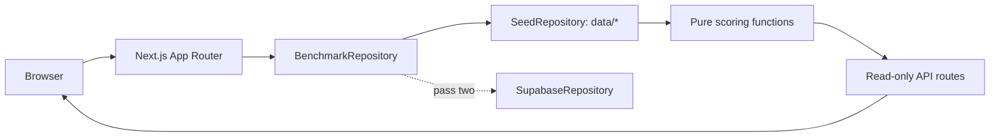

# MidMarketBench

Frontier model benchmarking for European lower-mid-market investment work.

[](https://midmarketbench.vercel.app)
[](https://nextjs.org)
[](https://react.dev)
[](https://www.typescriptlang.org)
[](#data-integrity)


MidMarketBench asks a practical question: can a frontier model turn a messy, sparse, commercially sensitive diligence packet into work an investment team can actually use?

The current repo is a public product shell with synthetic cases, synthetic standings, typed seed data, a read-only API, deterministic score aggregation and a clean Supabase boundary for the operational benchmark. It is not yet claiming observed provider performance.

| Item         | Current state                                                  |
| ------------ | -------------------------------------------------------------- |
| Live product | [midmarketbench.vercel.app](https://midmarketbench.vercel.app) |
| Methodology  | `v0.3`                                                         |
| Run mode     | closed-book                                                    |
| Status       | product shell live, evaluation runner pending                  |

## Why It Exists

Most AI benchmarks are excellent for general capability and weak for investment workflow usefulness. They rarely test whether a model can:

- challenge a management narrative without inventing facts
- reconcile revenue, retention and concentration data
- spot the risks that actually change a deal recommendation
- avoid US-market assumptions when working on European software companies
- produce memo-ready output with a clear next action

MidMarketBench is built for that gap. It treats LLM output as investment work product, not as a parlour trick.

## What Is In The Repo

| Layer            | What exists today                                                   | Notes                                                                  |
| ---------------- | ------------------------------------------------------------------- | ---------------------------------------------------------------------- |
| Public site      | Next.js App Router product shell                                    | Homepage, leaderboard, model pages, cases, methodology and about pages |
| Benchmark data   | Typed seed data in `data/`                                          | 12-model roster, eight scoring dimensions, one live synthetic case     |
| Scoring          | Pure TypeScript aggregation in `lib/scoring.ts`                     | Overall is always derived from weighted dimension scores               |
| API              | Read-only `/api/v1/*` routes                                        | Leaderboard, model roster, cases and health                            |
| Storage boundary | `BenchmarkRepository` abstraction                                   | Seed data works now; Supabase is scaffolded for pass two               |
| Integrity checks | Copy, lint, typecheck, unit tests, build and Playwright smoke tests | `npm run check` is the main local gate                                 |

## Product Snapshot

The public app currently presents a synthetic benchmark board for a configured model roster including GPT-5.5, Claude Opus 4.8, Gemini 3.5 Flash, GPT-5.4, Claude Opus 4.7, Gemini 3.1 Pro, Grok 4.20, GLM-5.2, Qwen3.7 Max, Seed 2.0 Pro, DeepSeek V4 Pro and GPT-5.2 Pro.

The standing board is deliberately labelled synthetic. The useful artefacts in this pass are the product surface, case design, data contracts, scoring shape and repository boundary.

| Rank | Model            | Provider  | Synthetic overall | Strongest signal in the demo                    |
| ---: | ---------------- | --------- | ----------------: | ----------------------------------------------- |
|    1 | GPT-5.5          | OpenAI    |              83.9 | Grounding, risk discovery and output usefulness |
|    2 | Claude Opus 4.8  | Anthropic |              82.8 | Scepticism and numerical sanity                 |
|    3 | Gemini 3.5 Flash | Google    |              79.5 | Numerical sanity and grounding                  |
|    4 | GPT-5.4          | OpenAI    |              78.4 | Grounding and output usefulness                 |
|    5 | Claude Opus 4.7  | Anthropic |              76.9 | Grounding and numerical sanity                  |

Full model metadata lives in [`data/models.ts`](data/models.ts). Roster provenance is tracked in [`notes/model-roster.md`](notes/model-roster.md).

## Scoring Model


Overall is calculated from eight dimension scores. It is never stored directly in TypeScript or SQL.

```text
overall =
  grounding              * 0.15 +
  commercial judgement   * 0.20 +
  scepticism             * 0.15 +
  numerical sanity       * 0.15 +
  risk discovery         * 0.15 +
  question generation    * 0.10 +
  European context       * 0.05 +
  output usefulness      * 0.05
```

Commercial judgement carries the most weight because a grounded but commercially naive answer should not win an investment benchmark.

| Dimension            | Weight | What a high score means                                               |
| -------------------- | -----: | --------------------------------------------------------------------- |
| Commercial judgement |    20% | Prioritises revenue quality, durability and decision impact           |
| Grounding            |    15% | Supports claims with packet evidence or marks inference clearly       |
| Scepticism           |    15% | Challenges weak claims, inflated metrics and convenient narratives    |
| Numerical sanity     |    15% | Reconciles financial and operating data correctly                     |
| Risk discovery       |    15% | Finds hidden and second-order risks across the packet                 |
| Question generation  |    10% | Asks specific questions likely to change the recommendation           |
| European context     |     5% | Accounts for fragmented markets, regulation, language and procurement |
| Output usefulness    |     5% | Produces material a deal team can reuse with limited editing          |

## Case Library

The live case is **Veritalis Compliance Cloud**, a synthetic DACH, UK and Benelux compliance workflow SaaS company.

| Field         | Value            |
| ------------- | ---------------- |
| Stage         | Lower mid-market |
| Sector        | B2B Software     |
| ARR           | EUR 18.4m        |
| Growth        | 24%              |
| EBITDA margin | 12%              |
| Ownership     | Founder-owned    |
| Difficulty    | Medium           |

The case packet includes company narrative, ARR bridge, retention cohorts, customer concentration, management Q&A, five tasks and a gated answer key. Pipeline cases cover healthcare workforce management, cybersecurity compliance, industrial field service and legal document automation.

## Evaluation Flow


The operational benchmark should move from a public shell to persisted run artefacts:

```text
synthetic packet
      |
      v
standard prompt + run mode
      |
      v
model output from GPT-5.5, Claude Opus 4.8, Gemini 3.5 Flash, ...
      |
      v
deterministic checks: schema, arithmetic, answer-key coverage
      |
      v
blind LLM judge + human calibration
      |
      v
versioned scorecard with cost, latency and raw output
```

The important design choice is traceability. A future score should point back to the exact model, prompt hash, parameters, packet version, raw output, evaluator version, token cost and latency.

## Architecture

```text
app/* routes and pages
        |
        v
components/* presentation
        |
        v
lib/repo/BenchmarkRepository
   |                         |
   v                         v
SeedRepository          SupabaseRepository
data/* today            pass two boundary
   |
   v
lib/scoring.ts
derived rankings and API responses
```



Key technical choices:

- Next.js 15 App Router and React 19
- strict TypeScript with `noUncheckedIndexedAccess`
- Tailwind 4 tokens plus small local component CSS
- Server Components by default
- client JavaScript limited to sorting, charts, theme and banner dismissal
- repository boundary for seed data now and Supabase later
- deterministic score aggregation with stable tie-breaks

The compressed decision record is in [`notes/architecture.md`](notes/architecture.md).

## Public API

All API routes are read-only in pass one.

| Route                     | Purpose                                       |
| ------------------------- | --------------------------------------------- |
| `GET /api/v1/health`      | Service and methodology status                |
| `GET /api/v1/leaderboard` | Ranked synthetic results with derived Overall |
| `GET /api/v1/models`      | Current model roster metadata                 |
| `GET /api/v1/cases`       | Public synthetic cases                        |
| `GET /api/v1/cases/:slug` | One public case and packet manifest           |

Example:

```bash
curl https://midmarketbench.vercel.app/api/v1/leaderboard
```

```bash
curl https://midmarketbench.vercel.app/api/v1/cases/compliance-workflow-saas
```

## Repository Map

```text
app/          routes, metadata, API handlers and page composition
components/   product UI components
data/         typed synthetic benchmark data
lib/          scoring, formatting, types, repository boundary and Supabase clients
notes/        architecture and model-roster provenance
public/       static visual assets
scripts/      local quality checks
supabase/     pass-two schema and seed handover
tests/        Playwright smoke coverage
```

## Run Locally

Requirements: Node.js 20 or later and npm 10 or later.

```bash
cp .env.example .env.local
```

```bash
npm install
```

```bash
npm run dev
```

Open [localhost:3000](http://localhost:3000).

## Verify

Use the full local gate before shipping code changes:

```bash
npm run check
```

Optional browser smoke tests:

```bash
npx playwright install chromium
```

```bash
npm run test:e2e
```

Copy checks intentionally reject em dashes and italic markup in product copy.

## Supabase Handover

Supabase is present as an explicit pass-two boundary, not as a hidden production dependency.

1. Run `supabase/migrations/0001_init.sql`.
2. Run `supabase/seed.sql`.
3. Generate database types into `lib/supabase/types.ts`.
4. Implement typed query mappings in `SupabaseRepository`.
5. Set `USE_SUPABASE=true`.
6. Provide the public URL and anonymous key.

RLS exposes public display records as read-only. Evaluation writes require a private service role and must stay outside the browser client.

## Data Integrity

- All company and deal data are synthetic.
- Current scores, ranks, rank changes, release months and unspecified technical metadata are illustrative.
- Public cases are meant to explain the method. Private holdouts should never be committed to this repository.
- Model names are tracked in [`data/models.ts`](data/models.ts), with provenance notes in [`notes/model-roster.md`](notes/model-roster.md).
- The benchmark evaluates workflow usefulness, not investment opportunities.

## Roadmap

| Slice      | Outcome                                                                                            |
| ---------- | -------------------------------------------------------------------------------------------------- |
| Runner     | Provider-agnostic execution with model, prompt hash, parameters, raw output, token use and latency |
| Scoring    | Deterministic checks, blind judge scoring, human calibration and agreement reporting               |
| Storage    | Typed Supabase mappings, migrations, RLS and persisted run artefacts                               |
| Cases      | Five public cases plus private holdouts                                                            |
| Operations | CI, branch protection, monitoring, custom domain and real contact address                          |
| Results    | Replace synthetic standings only after run artefacts are persisted and reviewable                  |

## Non-Goals

- Not a general intelligence leaderboard.
- Not investment advice.
- Not a claim that the synthetic standings reflect observed model performance.
- Not a place to store proprietary deal material or private holdouts.

## Licence

No licence file is present yet. Treat the repository as all rights reserved unless Charlie adds one.
